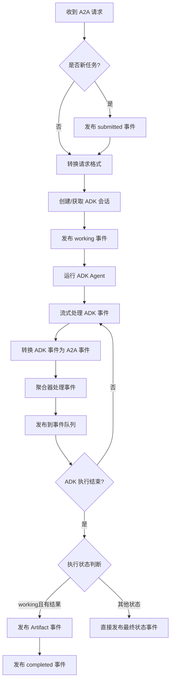

这段代码实现了一个 **A2aAgentExecutor** 类，它作为 A2A（Agent-to-Agent）服务器和 ADK（Agent Development Kit）Agent 之间的桥梁。让我详细解析其设计思想、主要功能和工作流程：

## 设计思想

### 1. **适配器模式（Adapter Pattern）**
- 将 A2A 协议与 ADK 框架连接起来
- 通过转换器（Converters）在不同数据格式间转换：
  - `A2APartToGenAIPartConverter`：A2A 部件 → ADK 部件
  - `GenAIPartToA2APartConverter`：ADK 部件 → A2A 部件
  - `A2ARequestToAgentRunRequestConverter`：A2A 请求 → ADK 请求
  - `AdkEventToA2AEventsConverter`：ADK 事件 → A2A 事件

### 2. **事件驱动架构**
- 使用 `EventQueue` 发布任务状态更新
- 支持实时状态推送和最终结果通知
- 遵循 A2A 协议的事件规范

### 3. **异步流处理**
- 使用异步生成器处理 ADK Agent 的流式输出
- 实时转换并转发事件

## 主要功能

### 1. **A2A 请求执行**
- 接收 A2A 标准的请求
- 驱动 ADK Agent 执行任务
- 管理任务生命周期

### 2. **状态管理**
- 跟踪任务状态：submitted → working → completed/failed
- 发布状态更新事件

### 3. **会话管理**
- 自动创建或重用 ADK 会话
- 维护会话状态

### 4. **异常处理**
- 捕获执行中的异常
- 发布失败状态事件
- 确保事件队列的可靠性

### 5. **结果聚合**
- 使用 `TaskResultAggregator` 收集和聚合任务结果
- 区分最终结果和中间更新

## 工作流程



### 详细步骤：

1. **初始化阶段**
   ```python
   # 配置转换器
   config = A2aAgentExecutorConfig(
       a2a_part_converter=...,
       gen_ai_part_converter=...,
       request_converter=...,
       event_converter=...
   )
   
   # 创建执行器
   executor = A2aAgentExecutor(
       runner=runner,
       config=config
   )
   ```

2. **任务启动**
   - 检查是否为新任务
   - 发布 `TaskStatusUpdateEvent`（submitted状态）
   - 解析并准备 ADK Runner

3. **请求转换**
   ```python
   # A2A请求 → ADK请求
   run_request = convert_a2a_request_to_agent_run_request(
       context,
       a2a_part_converter
   )
   ```

4. **会话准备**
   - 检查现有会话
   - 不存在时创建新会话
   - 更新会话ID

5. **Agent 执行**
   ```python
   # 异步流式执行
   async with runner.run_async(**vars(run_request)) as agen:
       async for adk_event in agen:
           # 实时转换和发布事件
           a2a_event = convert_event_to_a2a_events(
               adk_event,
               invocation_context,
               task_id,
               context_id,
               gen_ai_part_converter
           )
           await event_queue.enqueue_event(a2a_event)
   ```

6. **结果处理**
   - 如果状态为`working`且有输出，发布`TaskArtifactUpdateEvent`
   - 然后发布`TaskStatusUpdateEvent`（completed状态）
   - 否则直接发布最终状态事件

## 关键特性

### 1. **灵活性**
- 可配置的转换器，支持自定义数据格式转换
- 支持同步和异步 Runner 获取

### 2. **可靠性**
- 异常处理确保事件发布
- 任务状态机管理
- 资源清理（使用`Aclosing`）

### 3. **可扩展性**
- 实验性标记（@a2a_experimental）表示API可能演进
- 模块化设计便于替换组件

### 4. **元数据传递**
- 传递ADK相关信息到A2A事件元数据
- 包括app_name、user_id、session_id等

这个执行器的核心价值在于**无缝集成两个不同的Agent框架**，使ADK Agent能够以A2A协议的标准接口提供服务，同时保持两个系统的独立性和可维护性。