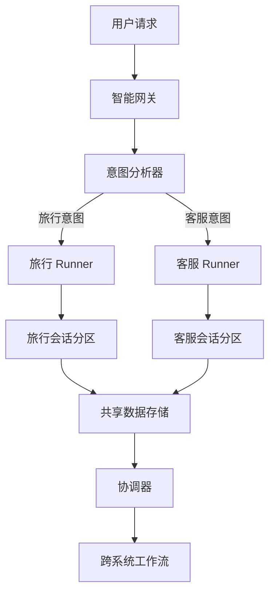

# 多个 Agent 共享 Session 的详细分析

让我逐步分析这个问题，然后提出最优的解决方案。

## 第一步：理解当前问题

### 1.1 问题场景描述

假设有**两个独立的 Runner**，它们：
1. 使用**同一个 session_id**（共享会话）
2. 有**不同的 root_agent**结构
3. 都尝试处理同一个会话中的事件

```python
# Runner A（旅行系统）
runner_a = Runner(
    app_name="travel_app",
    agent=travel_root_agent,  # 包含 travel_agent, flight_agent 等
    session_service=shared_session_service
)

# Runner B（客户服务系统）  
runner_b = Runner(
    app_name="customer_service_app",
    agent=cs_root_agent,  # 包含 support_agent, billing_agent 等
    session_service=shared_session_service  # 同一个服务
)

# 两个 Runner 都访问同一个 session
session_id = "session_123"
```

### 1.2 问题产生流程

当用户先与旅行系统交互，然后联系客户服务：

```python
# 时间线：
1. 用户通过 Runner A 开始对话："我想预订去巴黎的旅行"
2. Runner A 的 travel_agent 处理，产生事件（author="travel_agent"）
3. 用户遇到问题，联系客户服务："我的预订有问题"
4. Runner B 尝试处理这个消息，调用 _find_agent_to_run()

# 问题出现：
_find_agent_to_run() 会查看会话历史，发现：
- 事件1: author="user" → 过滤掉
- 事件2: author="travel_agent" → 尝试查找

# root_agent.find_sub_agent("travel_agent") 在 Runner B 中
# travel_agent 不是 cs_root_agent 的子代理 → 返回 None
# 日志："Event from an unknown agent: travel_agent"
```

## 第二步：分析 `_find_agent_to_run` 的逻辑

### 2.1 当前逻辑缺陷

```python
def _find_agent_to_run(self, session: Session, root_agent: BaseAgent) -> BaseAgent:
    # ...
    for event in filter(_event_filter, reversed(session.events)):
        if event.author == root_agent.name:
            return root_agent
        if not (agent := root_agent.find_sub_agent(event.author)):  # ← 问题在这里
            logger.warning('Event from an unknown agent: %s', event.author)
            continue
        if self._is_transferable_across_agent_tree(agent):
            return agent
    return root_agent  # ← 最终返回自己的 root_agent
```

**问题**：代码假设会话中的所有事件都来自**当前 Runner 的代理树**，但多个 Runner 共享会话时，这个假设不成立。

### 2.2 实际行为

1. **找不到其他 Runner 的代理** → 发出警告
2. **继续查找**，直到找到当前 Runner 的代理或返回 root_agent
3. **最终结果**：每个 Runner 都认为自己应该处理消息，可能导致混乱

## 第三步：分析多个 Agent 共享信息的真正需求

### 3.1 可能的业务场景

| 场景 | 描述 | 共享需求 |
|------|------|---------|
| **场景1** | 单一应用，多专业代理 | 完全共享，同一代理树 |
| **场景2** | 多团队协作应用 | 部分共享，不同代理树 |
| **场景3** | 跨应用集成 | 有限共享，独立系统 |
| **场景4** | 微服务架构 | 数据共享，业务分离 |

### 3.2 当前的 ADK 设计假设

从代码可以看出，ADK 设计假设：
1. **一个 Session 属于一个 App（Runner）**
2. **所有事件都来自同一个代理树**
3. **代理转移在树内进行**

这体现在：
- `_enforce_app_name_alignment()` 强制 App 名称对齐
- `_format_session_not_found_message()` 假设会话属于当前 App
- `_find_agent_to_run()` 在当前代理树中查找

## 第四步：最优解决方案分析

### 4.1 方案对比

| 方案 | 实现难度 | 数据隔离 | 代理协作 | 推荐度 |
|------|---------|---------|---------|--------|
| **方案A：单一 Runner，多代理树** | 低 | 好 | 优秀 | ⭐⭐⭐⭐⭐ |
| **方案B：会话分区（Branch 机制）** | 中 | 优秀 | 有限 | ⭐⭐⭐⭐ |
| **方案C：代理网关模式** | 高 | 好 | 优秀 | ⭐⭐⭐ |
| **方案D：修改框架逻辑** | 极高 | 好 | 优秀 | ⭐ |

### 4.2 推荐方案：单一 Runner + 代理协调器（方案A）

#### 架构设计：

```
单一 Runner (travel_app)
├── 主协调代理 (orchestrator_agent) - 负责路由
│   ├── 旅行子系统代理 (travel_sub_agent) - 原 travel_agent
│   │   ├── 航班代理 (flight_agent)
│   │   └── 酒店代理 (hotel_agent)
│   └── 客服子系统代理 (customer_service_sub_agent) - 原 cs_root_agent
│       ├── 支持代理 (support_agent)
│       └── 计费代理 (billing_agent)
```

#### 实现步骤：

**步骤1：创建协调器代理**

```python
class OrchestratorAgent(LlmAgent):
    def __init__(self):
        super().__init__(
            name="orchestrator",
            system_prompt="""
            你是系统协调器，负责将用户请求路由到合适的子系统：
            
            1. 旅行相关（预订、查询、取消） → 旅行子系统
            2. 客户服务（问题、投诉、退款） → 客服子系统
            3. 复杂问题 → 可能需要两个子系统协作
            
            根据用户意图决定路由。
            """,
            tools=[],  # 协调器本身不需要工具
        )
    
    async def route_request(self, context: InvocationContext):
        """分析用户意图，路由到合适子系统"""
        user_message = context.user_content.parts[0].text
        
        # 分析意图
        if self._is_travel_related(user_message):
            return self.find_sub_agent("travel_sub_agent")
        elif self._is_customer_service_related(user_message):
            return self.find_sub_agent("customer_service_sub_agent")
        else:
            # 默认或复杂情况
            return self  # 保持协调器处理
```

**步骤2：构建统一代理树**

```python
# 创建子系统代理
travel_sub_agent = TravelSubAgent(name="travel_sub_agent")
cs_sub_agent = CustomerServiceSubAgent(name="customer_service_sub_agent")

# 构建统一树
orchestrator = OrchestratorAgent(name="orchestrator")
orchestrator.add_sub_agent(travel_sub_agent)
orchestrator.add_sub_agent(cs_sub_agent)

# 旅行子系统内部结构
travel_sub_agent.add_sub_agent(flight_agent)
travel_sub_agent.add_sub_agent(hotel_agent)

# 客服子系统内部结构  
cs_sub_agent.add_sub_agent(support_agent)
cs_sub_agent.add_sub_agent(billing_agent)

# 创建单一 Runner
runner = Runner(
    app_name="unified_app",
    agent=orchestrator,  # 统一的根代理
    session_service=session_service
)
```

**步骤3：实现子系统间数据共享**

```python
class SharedDataManager:
    """管理子系统间共享数据"""
    
    @staticmethod
    async def share_travel_data(context: InvocationContext, travel_data: dict):
        """旅行数据共享给客服系统"""
        # 存储在 session.state 的共享区域
        context.session.state.setdefault("shared_data", {})
        context.session.state["shared_data"]["travel"] = travel_data
        
        # 添加共享标记
        context.session.state["shared_data"]["last_shared_by"] = "travel_system"
        context.session.state["shared_data"]["last_shared_at"] = datetime.now().isoformat()
    
    @staticmethod
    async def get_shared_travel_data(context: InvocationContext) -> Optional[dict]:
        """客服系统获取共享的旅行数据"""
        return context.session.state.get("shared_data", {}).get("travel")
```

**步骤4：协调跨子系统工作流**

```python
class CrossSystemWorkflow:
    """处理需要多个子系统协作的复杂任务"""
    
    async def handle_complex_issue(self, context: InvocationContext):
        """例如：旅行问题导致的退款请求"""
        
        # 步骤1：旅行系统分析问题
        travel_analysis = await travel_sub_agent.analyze_issue(context)
        
        # 步骤2：如果需要退款，触发客服系统
        if travel_analysis.get("requires_refund"):
            # 共享分析结果
            await SharedDataManager.share_travel_data(context, travel_analysis)
            
            # 转移控制权给客服系统
            await context.agent.transfer_to(cs_sub_agent)
            
            # 客服系统可以访问共享数据
            shared_data = await SharedDataManager.get_shared_travel_data(context)
            # 基于共享数据处理退款
```

### 4.3 方案B：会话分区（使用 Branch 机制）

如果必须保持子系统独立，可以使用 Branch 机制隔离对话：

```python
# 在 session.state 中记录子系统分支
session.state["subsystem_branches"] = {
    "travel": "root.travel_system",  # 旅行系统分支
    "customer_service": "root.customer_service"  # 客服系统分支
}

# 每个子系统在自己的分支中工作
class SubsystemRunner:
    async def run_in_branch(self, context: InvocationContext, subsystem: str):
        # 设置当前分支
        branch = context.session.state["subsystem_branches"][subsystem]
        context.branch = branch
        
        # 只看到本分支的历史
        branch_events = self._get_branch_events(context.session.events, branch)
        
        # 处理本分支的逻辑
        # ...
```

### 4.4 方案C：代理网关模式

```python
class AgentGateway:
    """网关负责接收请求，路由到合适的 Runner"""
    
    def __init__(self):
        self.runners = {
            "travel": travel_runner,
            "customer_service": cs_runner
        }
        self.session_service = shared_session_service
    
    async def route_and_process(self, user_id: str, session_id: str, message: str):
        # 1. 分析意图，选择 Runner
        intent = await self.analyze_intent(message)
        runner = self.runners[intent["runner"]]
        
        # 2. 处理消息
        events = []
        async for event in runner.run_async(
            user_id=user_id,
            session_id=session_id,
            new_message=message
        ):
            events.append(event)
            
            # 3. 检查是否需要跨 Runner 处理
            if self._needs_cross_runner_handling(event):
                # 触发另一个 Runner
                other_runner = self.runners[intent["secondary_runner"]]
                # ... 处理协作逻辑
        
        return events
```

## 第五步：总结与建议

### 5.1 根本原因

当前 `_find_agent_to_run` 的设计假设是：
**一个会话只属于一个代理树（一个 Runner）**

当多个 Runner 共享会话时，这个假设被打破，导致：
1. **警告日志**：找不到其他 Runner 的代理
2. **逻辑混乱**：每个 Runner 都认为应该处理消息
3. **数据不一致**：可能的状态冲突

### 5.2 推荐解决方案

根据复杂度和实际需求，我推荐：

#### **对于大多数场景：方案A（单一 Runner + 协调器）**
- **优点**：框架原生支持，无需修改 ADK
- **缺点**：需要重构代理结构
- **适用**：新项目或可以重构的系统

#### **对于已有独立系统：方案C（网关模式）**
- **优点**：最小化改动，保持现有系统独立
- **缺点**：需要额外网关层，复杂度增加
- **适用**：已有多个独立系统需要集成

#### **对于高级场景：方案B（Branch 机制）**
- **优点**：数据隔离好，框架部分支持
- **缺点**：需要深入理解 Branch 机制
- **适用**：需要严格隔离的子系统

### 5.3 不推荐的方案

**方案D（修改框架逻辑）** 不推荐，因为：
1. 需要修改 ADK 核心代码
2. 可能破坏现有功能
3. 维护成本高
4. 升级困难

### 5.4 具体实施建议

**短期应急方案**：
```python
# 修改 _find_agent_to_run 添加 Runner 标识检查
def _find_agent_to_run(self, session: Session, root_agent: BaseAgent):
    # 在事件中存储 runner_id
    for event in filtered_events:
        if hasattr(event, 'runner_id') and event.runner_id != self.app_name:
            continue  # 跳过其他 Runner 的事件
        # ... 原有逻辑
```

**长期架构方案**：


**关键设计原则**：
1. **单一责任**：每个 Runner 专注于一个业务域
2. **明确边界**：通过网关或协调器明确系统边界
3. **数据共享**：通过明确的共享机制（session.state）共享必要数据
4. **状态管理**：每个子系统管理自己的状态，协调全局状态

通过这种架构，既可以保持系统的模块化和可维护性，又可以实现多个代理系统之间的有效协作和数据共享。